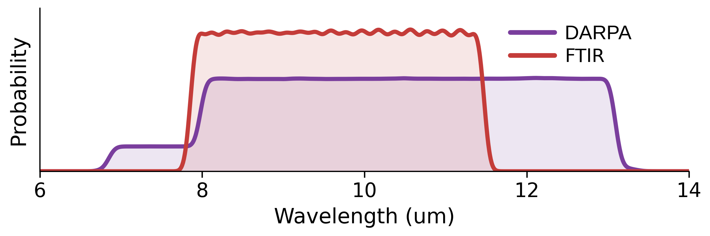
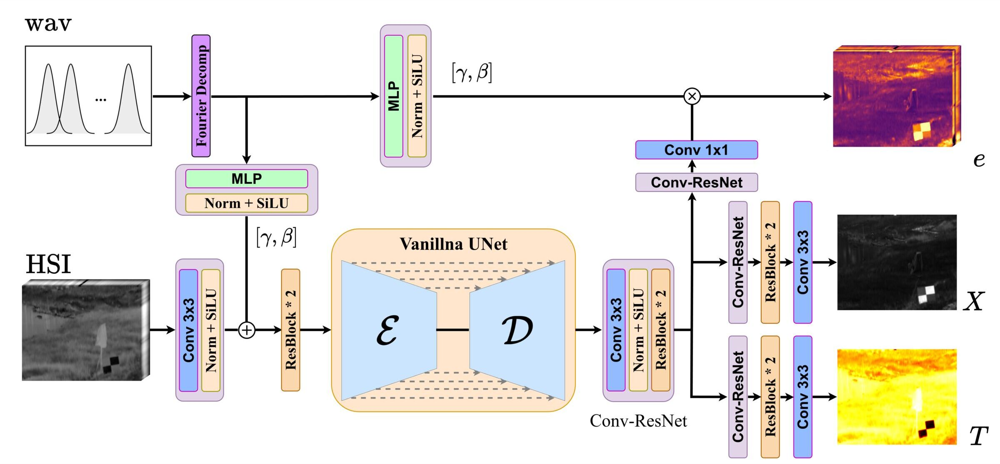
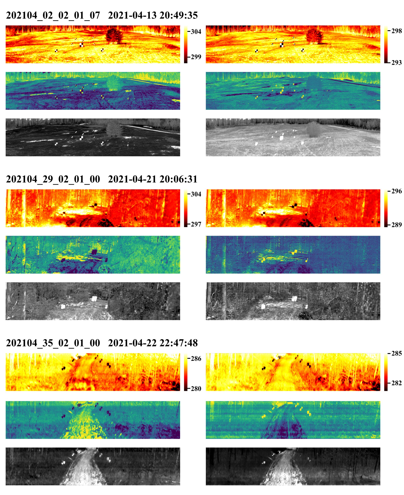
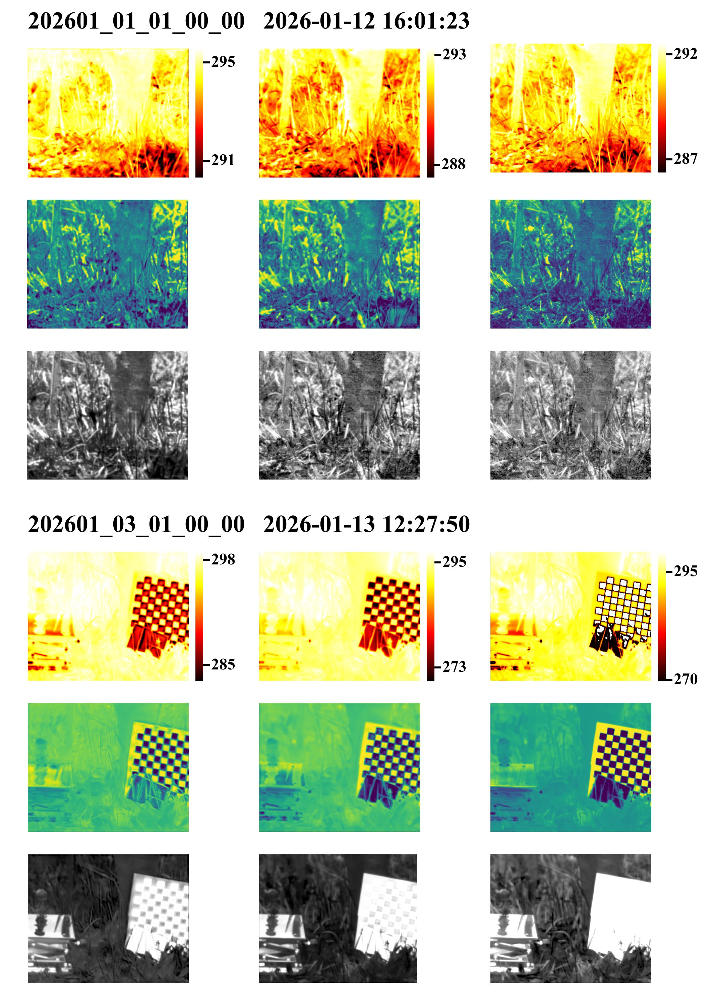

# TeX-1500

**A paired real-world LWIR hyperspectral dataset and benchmark for temperature--emissivity--texture decomposition.**

[](https://arxiv.org/pdf/2606.03806)
[](https://huggingface.co/datasets/jialelin2007/TeX-1500)
[](https://github.com/dccc2025/TeX-1500)
[](https://www.python.org/)

TeX-1500 is a paired LWIR hyperspectral benchmark for HADAR-oriented recovery of
temperature `T`, emissivity `e`, and scalar texture `X`. The dataset contains
1,522 calibrated real-scene HSI--TeX pairs from DARPA Invisible Headlights
pushbroom imagery and FTIR acquisitions, covering multiple locations, seasons,
acquisition times, wavelength layouts, and sensor families.

This repository provides the inference-only TeX-UNet baseline: model
architecture, full-scene variable-band inference, output writers, and a compact
command line interface. Training code, raw data, and checkpoints are not stored
in this GitHub repository.

## Paper

**TeX-1500: A Paired Real-World LWIR Hyperspectral Dataset and Benchmark for Temperature--Emissivity--Texture Decomposition**

Cheng Dai*, Jiale Lin*, Hongyi Xu, Bingxuan Song, Ziyang Xie, and Fanglin Bao

Westlake University

`*` Equal contribution. Corresponding author: Fanglin Bao.

## Dataset

| Split | Location | Scenes | Images | Wavelengths | Spatial size | Bands |
|---|---:|---:|---:|---|---|---:|
| DARPA IH train | TPG, AZ / ME / FL | 74 | 1,096 | 6.8--13.2 um | 260x1200 to 480x1700 | 250/256 |
| DARPA IH valid | Sidewinder Range, TPG, AZ | 8 | 51 | 8.1--13.2 um | 260x1280 | 256 |
| DARPA IH test | Fort A. P. Hill, VA | 18 | 233 | 8.1--13.2 um | 260x1600 | 256 |
| FTIR train | Wuhan University, China | 38 | 111 | 7.9--11.5 um | 320x256 | 86 |
| FTIR test | Wuhan University, China | 16 | 31 | 7.9--11.5 um | 320x256 | 86/124/277 |

Dataset files are hosted on Hugging Face:

```text
https://huggingface.co/datasets/jialelin2007/TeX-1500
```



## TeX-UNet Baseline

TeX-UNet maps calibrated HSI bands and their wavelength positions to normalized
TeX fields. During inference, it repeatedly samples 64 valid bands until each
valid band reaches the requested minimum coverage, runs the network on full
images or sliding windows, and averages the accumulated predictions.



## Installation

The project is packaged for `uv`.

```bash
git clone https://github.com/dccc2025/TeX-1500.git
cd TeX-1500

uv sync
source .venv/bin/activate
```

For a deterministic Python version, use:

```bash
uv sync --python 3.10
source .venv/bin/activate
```

To run without activating the environment:

```bash
uv run tex1500-infer --help
```

## Checkpoints

Checkpoints will be released on Hugging Face after the model files are uploaded.
GitHub should only contain code and lightweight assets. Place downloaded weights
under `checkpoints/`, for example:

```text
checkpoints/tex_unet_v2.pt
```

The download helper is already wired for the expected Hugging Face layout:

```bash
uv run python scripts/download_weights.py \
  --repo-id dccc2025/TeX-1500-baselines \
  --filename tex_unet_v2/final.pt \
  --output checkpoints/tex_unet_v2.pt
```

## Quick Inference

Run TeX-UNet on one calibrated HSI scene:

```bash
uv run tex1500-infer \
  --input path/to/hsi.mat \
  --checkpoint checkpoints/tex_unet_v2.pt \
  --model-config configs/tex_unet_v2_model.json \
  --output-dir outputs/example \
  --num-bands 64 \
  --min-band-coverage 5
```

The input may be `.mat`, `.npy`, or `.npz`. For `.mat`/`.npz`, the loader looks
for common keys such as `denoised_hsi_original`, `denoised_hsi`, `hsi`, `HSI`,
`working_wav`, `hsi_wav`, `wavelength`, and `good_band_indices`.

Outputs are written as:

```text
outputs/example/
  prediction.npz
  prediction.mat
  T_norm.npy
  T_kelvin.npy
  emissivity_norm.npy
  texture_norm.npy
  T.png
  emissivity_midband.png
  texture.png
```

`T_kelvin` is denormalized with the TeX-UNet training range `[243 K, 343 K]`.
`e` and `X` are emitted in the normalized target space used by the baseline.

## Benchmark

| Test split | T MAE (K) | T MAPE (%) | e MSE | e SAM | X MSE | X Deg |
|---|---:|---:|---:|---:|---:|---:|
| DARPA IH-test | 7.3284 | 2.5488 | 0.0453 | 0.2267 | 0.0311 | 0.5206 |
| FTIR-zeroshot-test | 5.8309 | 1.9753 | 0.0674 | 0.0451 | 0.0219 | 0.2995 |
| FTIR-fewshot-test | 4.1004 | 1.3830 | 0.0458 | 0.1970 | 0.0220 | 0.2224 |





## Repository Scope

This release is intentionally narrow:

- included: TeX-UNet model architecture, inference utilities, CLI, docs, and selected paper assets;
- excluded: training pipeline, raw/private data, experiment logs, optimizer states, and checkpoints;
- hosted externally: TeX-1500 dataset and future pretrained checkpoints.

## Citation

```bibtex
@misc{dai2026tex1500,
  title        = {TeX-1500: A Paired Real-World LWIR Hyperspectral Dataset and Benchmark for Temperature--Emissivity--Texture Decomposition},
  author       = {Dai, Cheng and Lin, Jiale and Xu, Hongyi and Song, Bingxuan and Xie, Ziyang and Bao, Fanglin},
  year         = {2026},
  archivePrefix = {arXiv},
  eprint       = {2606.03806},
  primaryClass = {cs.CV}
}
```

## Acknowledgements

This repository builds on HADAR-style thermal physical decomposition and uses
the DARPA Invisible Headlights pushbroom imagery together with FTIR acquisitions
collected by the authors.
